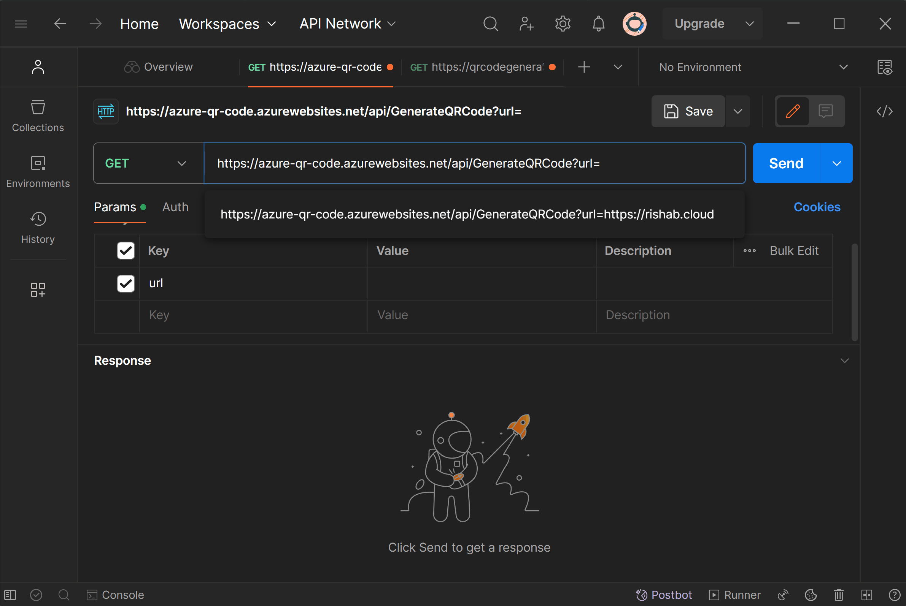
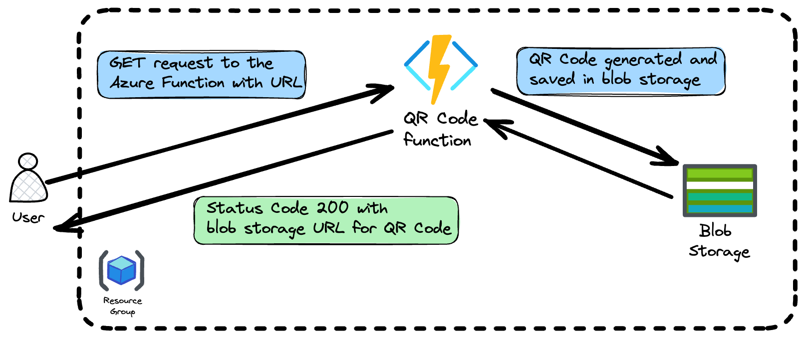

# Azure QR Code Generator

[](https://github.com/rishabkumar7/azure-qr-code/actions/workflows/main_qr-code-generator7.yml)

This repository contains the code for serverless Azure Function that generates QR codes for provided URLs and stores them in Azure Blob Storage. The function is written in JavaScript and can be triggered via HTTP requests.

## Demo

Send a `GET` request to the Azure Function `https://azure-qr-code.azurewebsites.net/api/GenerateQRCode` with `url` as parameter.

`curl` example:

``` bash
curl -X GET https://azure-qr-code.azurewebsites.net/api/GenerateQRCode -H "Content-Type: application/json" -d '{"url":"https://www.example.com"}'
```

Postman example:


## Architecture



## Features

-   **Serverless**: Leverages Azure Functions for minimal infrastructure management.
-   **QR Code Generation**: Dynamically creates QR codes for any given URL.
-   **Azure Blob Storage**: Stores the generated QR codes in the cloud for easy access and management.

## Prerequisites

-   [Node.js](https://nodejs.org/)
-   [Azure Functions Core Tools](https://learn.microsoft.com/en-us/azure/azure-functions/functions-run-local?tabs=linux%2Cisolated-process%2Cnode-v4%2Cpython-v2%2Chttp-trigger%2Ccontainer-apps&pivots=programming-language-csharp)
-   Azure CLI
-   An Azure account and an Azure Blob Storage account.

## Getting Started

### 1. Clone the Repository

``` bash
git clone https://github.com/rishabkumar7//azure-qr-code.git
cd azure-qr-code/qrCodeGenerator
```

### 2. Install Dependencies

```bash
npm install
```

### 3. Local Configuration

Set up your `local.settings.json` file with the necessary configuration values:

```json
{
    "IsEncrypted": false,
    "Values": {
        "AzureWebJobsStorage": "<YOUR_STORAGE_CONNECTION_STRING>",
        "FUNCTIONS_WORKER_RUNTIME": "node",
	      "STORAGE_CONNECTION_STRING":"<YOUR_STORAGE_CONNECTION_STRING>"
    }
}
```

### 4. Running Locally

To start the function app locally, make sure you have Azure Functions Core Tools installed, then run:

```bash
func start
```

### 5. Deploy to Azure

Deploy your function app to Azure using the following command:

```bash
func azure functionapp publish <YOUR_FUNCTION_APP_NAME>
```

Publish your local settings including the storage account key to Azure

```bash
func azure functionapp publish <YOUR_FUNCTION_APP_NAME> --publish-settings-only
```

## Usage

Send a `GET` request to your function's endpoint with a JSON payload containing the URL:

`curl -X GET https://<YOUR_FUNCTION_URL>/api/GenerateQRCode -H "Content-Type: application/json" -d '{"url":"https://www.example.com"}'`

## Author

- Twitter: [@rishabincloud](https://twitter.com/rishabincloud)
- GitHub: [@rishabkumar7](https://github.com/rishabkumar7)
